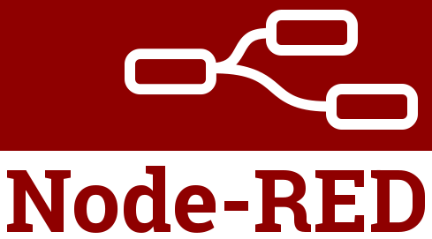
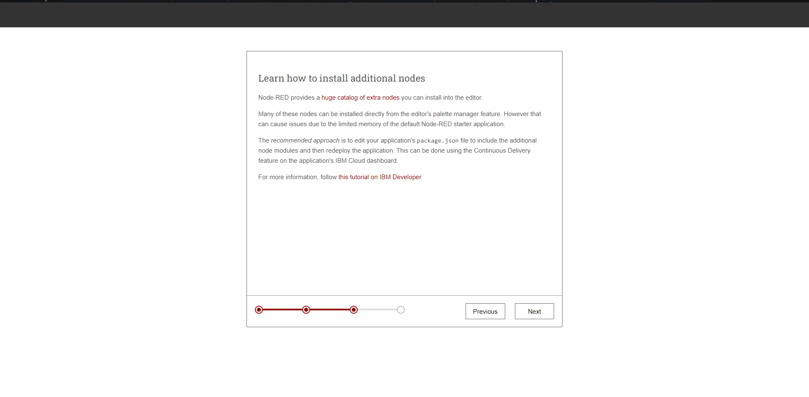

# Node RED & IoT

Crea una plataforma para integrar diferentes dispositivos de IoT (Internet of Things) 
 
# Pre-requisitos
•	Tener una cuenta de [**IBM Cloud**](https://cloud.ibm.com/login). 
•	Tener una cuenta de IBM Cloud con Pay-as-you-go

# Cupones para Estudiantes y profesores
1.	Acceder al [**HUB para Software para uso académico**](https://onthehub.com/ibm/?utm_sourc=ibm-ai-productpage&utm_medium=onthehubproductpage&utm_campaign=IBM). Y navegar hasta la parte de abajo de la pagina  
2.	Buscar el WebStore del instituto/escuela al que perteneces. 
3.	En caso de no contar con WebStore, acceder al portal de [**IBM Academic Initiative**](https://my15.digitalexperience.ibm.com/b73a5759-c6a6-4033-ab6b-d9d4f9a6d65b/dxsites/151914d1-03d2-48fe-97d9-d21166848e65/home/), registrarse o iniciar sesión y seleccionar la opción de Students 
4.	Seleccionar Add to Cart para IBM Bluemix – 6 Month Trial. 
5.	Realizar el registro correspondiente utilizando la cuenta de correo académica 

# Cargar créditos en IBM Cloud (Se necesita para acceder a Kubernetes en IBM Cloud)
1.	Ingresamos a nuestro panel de control de IBM Cloud (console.bluemix.net)
2.	Una vez que tengamos el código nos vamos a Gestionar>Facturación y Uso>Facturación
3.	Buscamos “Códigos de características (Promocionales)”

## Contenido
* [Creación una aplicacion Node-RED](#Creación-de-Node-Red).
* [Creación de la plataforma](#Creación-de-la-plataforma).
* [Habilitar la opción de continuous delivery](#Habilitar-la-opción-de-continuous-delivery).
* [Abrir el editor visual de Node-RED](#Abrir-el-editor-visual-de-Node-RED).
* [Configurar la aplicación de Node-RED](#Configurar-la-aplicación-de-Node-RED).
* [Añadir nodos extra a Node-RED](#Añadir-nodos-extra-a-Node-RED).
* [Despliegue de la Plataforma de Watson IoT](#Despliegue-de-la-Plataforma-de-Watson-IoT).

# Creación una aplicacion Node-RED
1. Iniciar sesión en [**IBM Cloud**](https://cloud.ibm.com/login). 
2. Abrir el catálogo, buscar node-red  
 
3. Nombrar el servicio con un nombre unic y darle en crear
 

# Creación de la plataforma
1. Selecionamos el boton de crear servicio
 
2. Seleccionamos la opcion de Internet of Things y le damos en crear
 
3. Seleccionamos el boton de siguiente
 
4. Verificamos las regiones y por ultimo le damos en listo
 

# Habilitar la opción de continuous delivery
1. Seleccionamos el boton de Desplegar su aplicacion
 
2. Seleccionamos la opcion de Kubernetes y le damos en siguiente
 
3. Le damos en el boton de crear y esperamos unos minutos
 

# Abrir el editor visual de Node-RED
1. Abrimos el link llamado URL de la aplicacion
 

# Configurar la aplicación de Node-RED
1. Seleccionamos siguiente
 
2. Creamos un usuario y contraseña para el servicio (puede ser diferente del usuario y contraseña de la cuenta)
 
3. Seleccionamos siguiente
 
4. Por ultimo, le damos en finalizar
 
5. Le damos en el boton de ir al Node-RED flow editor
 
6. Se abrira una pestaña similar a la siguiente
 

# Añadir nodos extra a Node-RED
Dentro de Node-RED podemos maejar todos los nodos adicionales que se ocuparan, y tambien se puede checar el estado del nodo, para dar un mantenimiento efectivo.
1. Nos vamos a la pantalla donde tenemos los URL, y seleccionamos la url de Fuente. Esto nos llevara a un repositorio de github donde se pueden editar los archivos
 
2. Seleccionamos en el archivo **package.json**
 
3. Damos click en el boton de editar
 
4. Añadimos el siguiente codigo, en la seccion de dependencias, en la penultima posicion. NOTA: No olvidar la coma del final
##  "node-red-contrib-scx-ibmiotapp": "0.x",
5. Añadimos un comentario del cambio y le damos en commit changes
 
6. Con este cambio, tendremos una pipeline para poder correr la app, podemos consultar el estao en la seccion de ci-pipelines.
 

# Despliegue de la Plataforma de Watson IoT
1. Regresamos a la pagina de detalles de la aplicacion, y seleccionamos en servicios, Internet of Things en el boton de abrir panel de control
 
2. Le damos click en el boton de Lanzar
 
3. En esta pestaña podemos añadir cualquier dispositivo a IoT para poder configurarlo y crear todo. 
 
